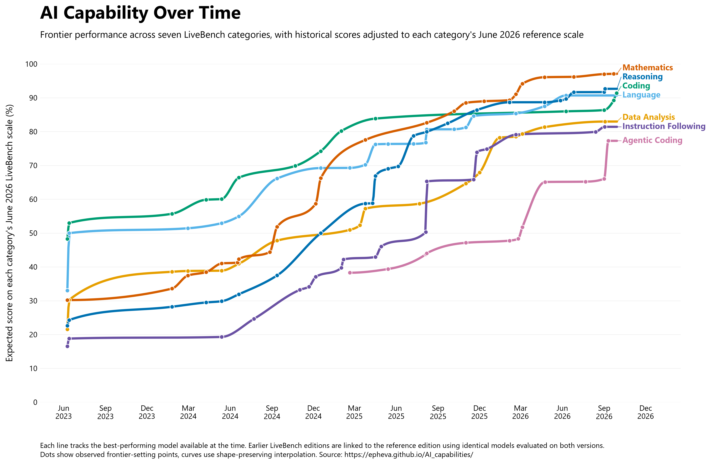
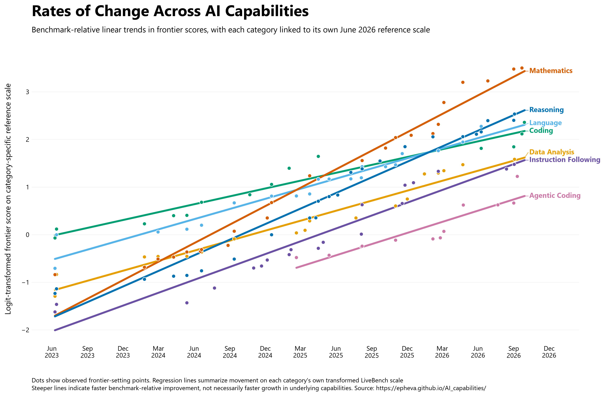

# Reconstructing the Evolution of AI Capabilities with LiveBench

A longitudinal analysis of how frontier AI performance changed across seven LiveBench capability categories, while accounting for changes in the benchmark itself.

**Model-release period:** 2023–2026  
**LiveBench editions:** June 2024–June 2026  
**Reference edition:** LiveBench 2026-06-25  
**Categories:** Mathematics, Reasoning, Coding, Language, Data Analysis, Instruction Following, and Agentic Coding

[Full technical write-up](https://epheva.github.io/AI_capabilities/)

---

## Overview

LiveBench is designed to remain useful as AI systems improve by regularly refreshing its questions, introducing harder tasks, and updating its evaluation framework. This reduces reliance on static test sets and helps limit contamination, but it also creates a measurement problem: a score from an older LiveBench edition is not necessarily directly comparable with the same score from a newer edition.

This project reconstructs historical AI capability frontiers by linking successive LiveBench editions using model snapshots evaluated on both versions. Historical scores are translated onto each category's June 2026 reference scale, then combined with independently collected model release dates to estimate how the frontier evolved over time.

The central question is:

> Which AI capability frontiers changed most rapidly over time after accounting for changes in the benchmark itself?

---

## Main results



All seven measured capability frontiers improved substantially over the period represented. Mathematics reaches the highest end-of-period score and also shows the steepest benchmark-relative historical trend. Within the common LiveBench framework, this is suggestive that mathematical capability may have progressed particularly rapidly relative to the other measured skills.

Reasoning, Language, and conventional Coding converge at relatively high end-of-period scores. Data Analysis and Instruction Following also improve substantially but remain lower, while Agentic Coding has the shortest history and the lowest final frontier.



The second figure summarizes the rate of frontier movement after converting the reconstructed percentages to the logit scale. This accounts for the bounded 0–100 score range and gives greater weight to improvements near the ceiling.

The category slopes are useful for comparing broad patterns of benchmark-relative progress, but the categories are not formally calibrated onto one identical latent ability scale. Differences in slope should therefore be interpreted as suggestive rather than as exact ratios of underlying capability growth.

---

## Why LiveBench?

LiveBench is particularly useful for this question because it combines several features in one evolving benchmark framework:

- Questions are regularly refreshed using recent material, reducing exposure to static test-set contamination.
- Answers are scored against objective, automatically checkable ground truth rather than human preference labels or LLM judges.
- The same fixed model snapshots often appear across multiple benchmark editions, creating natural anchors for longitudinal linking.
- Benchmark revisions are dated and documented.
- Capability categories can be reconstructed directly from published subtask scores.

These properties make LiveBench well suited to studying longitudinal change within a benchmark that itself evolves over time.

---

## Method

For each LiveBench edition, subtask scores were averaged within the published high-level capability categories. Model release dates were collected separately and matched to the exact LiveBench model identifiers.

Historical benchmark editions were then linked backward from the fixed June 25, 2026 reference edition. Within each capability category, models appearing on two adjacent editions served as common anchors. Scores were temporarily transformed to the logit scale and a Huber regression was fitted between the older scores and the later edition's already-equated reference-scale scores.

This procedure allows both the vertical position and spread of the score scale to change between benchmark editions while reducing the influence of unusual anchor models. Predictions were converted back to the 0–100 LiveBench scale after each mapping.

When a model appeared on multiple editions, its reconstructed scores were combined using the median. Models were then ordered by public release date, and the cumulative maximum within each category was used to construct the historical frontier.

For the rate-of-change figure, only genuine frontier-setting observations were used. Their reconstructed percentages were converted to logits and a linear trend was fitted separately within each category.

---

## Repository structure

```text
.
├── README.md
├── analysis.ipynb
├── livebench_capability_frontier.png
├── livebench_logit_growth.png
└── datasets/
    ├── table_*.csv
    ├── categories_*.json
    ├── livebench_model_release_dates_updated.xlsx
    └── outputs/
        ├── livebench_equated_to_reference.csv
        ├── livebench_model_capabilities_reference_scale.csv
        ├── livebench_best_by_release_date_reference_scale.csv
        ├── livebench_capability_frontiers_reference_scale.csv
        ├── livebench_capability_frontiers_display.csv
        ├── livebench_equating_diagnostics.csv
        └── livebench_logit_growth_rates.csv
```

The `datasets/` folder contains the historical LiveBench score tables, category definitions, and curated model release dates. The notebook `analysis.ipynb` reproduces the full analysis and writes intermediate and final tables to `datasets/outputs/`.

---

## Running the analysis

Install the Python dependencies:

```bash
pip install numpy pandas matplotlib scipy scikit-learn openpyxl
```

Then run:

```text
analysis.ipynb
```

The notebook expects the input files to be stored under `datasets/` using the structure shown above.

---

## Interpretation

The analysis reconstructs how performance changed on each LiveBench category after adjusting historical scores to that category's June 2026 reference edition.

Because all categories belong to the same evaluation framework and are designed to remain challenging for strong models, differences between their trajectories provide a useful basis for comparing broad patterns of progress. Large and consistent differences are suggestive that some underlying capabilities may have improved faster than others.

However, the categories contain different tasks and are not formally calibrated to identical difficulty or discrimination. The analysis therefore does not establish that one underlying capability improved a precise multiple faster than another.

---

## Relationship to Epoch AI's ECI

Epoch AI's Epoch Capabilities Index uses overlapping model evaluations to place many heterogeneous benchmarks onto a common capability scale. This project uses the same broad identification idea, that shared models can connect different measuring instruments, but applies it locally between successive versions of each LiveBench category.

The main distinction is longitudinal. Each LiveBench category is reconstructed independently through time, allowing Mathematics, Coding, Reasoning, Language, Data Analysis, Instruction Following, and Agentic Coding to exhibit different historical trajectories and fitted rates of change.

LiveBench also provides a comparatively controlled setting for this analysis because it regularly refreshes questions and uses objective scoring. Epoch's ECI combines heterogeneous benchmarks that do not all use the same contamination safeguards or scoring methods.

---

## Reproducibility notes

The analysis fixes LiveBench 2026-06-25 as the reference edition even if newer benchmark files are later added to the dataset folder.

Exact scores of 0 and 100 cannot be represented on the logit scale, so they are mapped to 0.1% and 99.9% only during the transformation step.

The smooth curves in the first figure are display-only, shape-preserving interpolations between observed frontier-setting points. They do not create additional observations. Likewise, the trend lines in the second figure are fitted only to genuine frontier observations.

---

## References

- White, C., Dooley, S., Roberts, M., et al. *LiveBench: A Challenging, Contamination-Free LLM Benchmark.* ICLR 2025. https://arxiv.org/abs/2406.19314
- LiveBench repository: https://github.com/LiveBench/LiveBench
- Epoch AI, *Capabilities & benchmarking*: https://epoch.ai/benchmarks
- Habba, E., Itzhak, I., Yehudai, A., et al. *Growing Pains: Extensible and Efficient LLM Benchmarking Via Fixed Parameter Calibration.* 2026. https://arxiv.org/abs/2604.12843
- METR, *Time Horizon 1.1.* 2026. https://metr.org/blog/2026-1-29-time-horizon-1-1/

