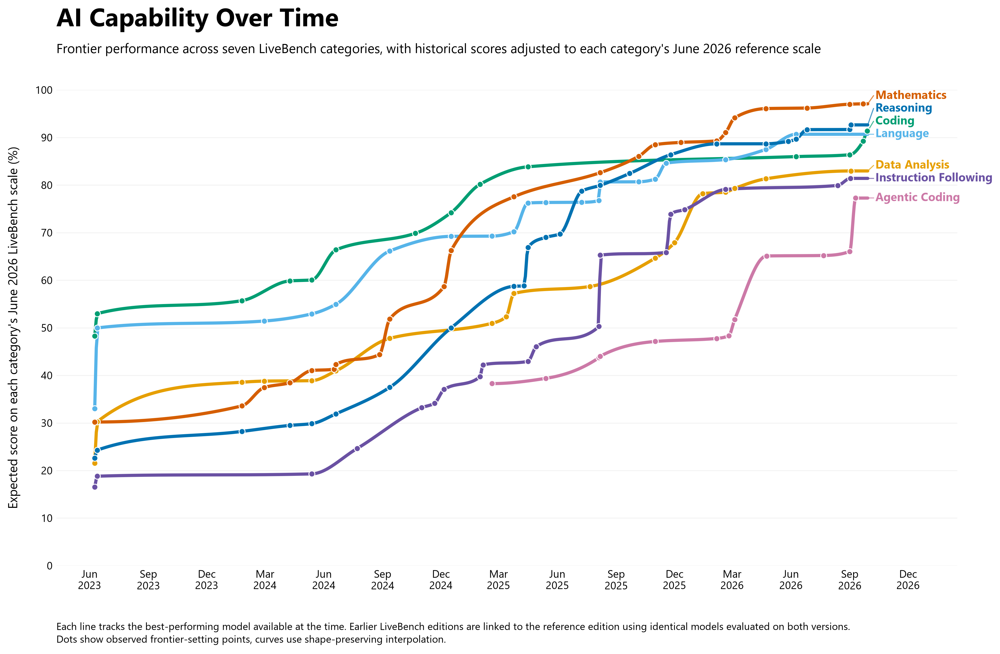
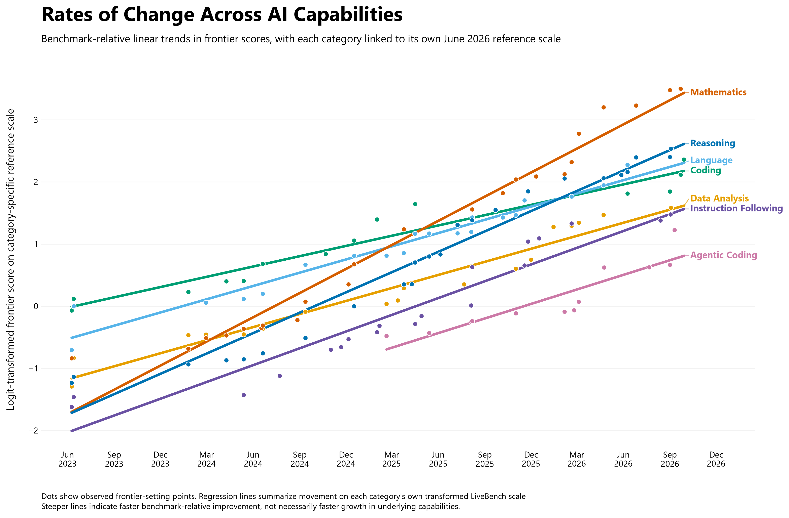

# Reconstructing the Evolution of AI Capabilities with LiveBench
## A longitudinal analysis using a common reference edition within each capability category

Model-release period represented: 2023–2026  
LiveBench editions used: June 2024–June 2026  
Reference edition: LiveBench 2026-06-25  
Primary outcome: Historical frontier performance by capability  
Secondary outcome: Descriptive benchmark-relative rate of frontier improvement    
Datasets & Reproducible Code: https://github.com/epheva/AI_capabilities 

---

## Summary

LiveBench was designed to reduce two common sources of benchmark bias. Its questions are regularly refreshed, often using recently released material, which reduces the risk that test questions appeared in a model's training data. It also uses objectively verifiable answers rather than human preference labels or LLM judges, allowing performance to be scored automatically and consistently.

These advantages come with an important measurement challenge. LiveBench itself changes over time: questions are refreshed, tasks are replaced, difficulty can increase, and new categories can be introduced. As a result, raw scores from different benchmark editions are not necessarily directly comparable. A longitudinal analysis therefore has to account for changes in the benchmark at the same time that it measures changes in model performance.

This project reconstructs historical frontier performance using eleven LiveBench editions from June 2024 through June 2026 and independently collected model release dates. Scores were aggregated into LiveBench's high-level capability categories. Within each category, models appearing on adjacent benchmark editions served as anchors. Their scores were linked with Huber regression on the logit scale, working backward recursively to express historical results on the June 2026 reference edition. Repeated estimates of the same model were combined by the median, and model release dates were then used to construct historical frontiers.

The main methodological distinction between this analysis and Epoch AI's domain-specific ECI, a related approach, is how longitudinal change is treated. Epoch first estimates benchmark difficulty and slope on a general ECI scale, then keeps those benchmark parameters fixed when calculating domain-specific ECI. A higher Math ECI still indicates stronger mathematics performance, but the long-run rate of change is not independently calibrated from the historical mathematics series. In this analysis, each LiveBench category is instead linked independently through time, allowing Mathematics, Coding, Reasoning, and the other categories to have their own benchmark-relative historical trajectories and rates of change.

LiveBench also differs from ECI in the consistency of its evaluation design. Epoch combines results from many heterogeneous benchmarks and does not require every included benchmark to use continually refreshed questions or exclusively objective, automatically verifiable scoring. Notably, Epoch itself notes that contamination can affect benchmark results. Models may have encountered similar or identical questions during training, artificially inflating measured performance. LiveBench therefore offers a more controlled setting for this particular longitudinal analysis, although its design reduces rather than eliminates the possibility of contamination.

Overall, I found that all measured categories show substantial frontier improvement over time. Interestingly, Mathematics reaches the highest end-of-period score and the steepest fitted benchmark-relative trend in this dataset.

---

# 1. Research question

The project began with a simple question:

> Which AI capabilities have changed most rapidly over time after accounting for changes in the benchmark itself?

A straightforward approach would be to collect historical leaderboard scores and plot them by model release date. For LiveBench, that would be misleading because the benchmark itself changes.


A score of 70 on an older edition may represent weaker performance than a score of 70 on a newer, harder edition. The main methodological problem is therefore not simply plotting the scores, but determining how scores from different benchmark editions can be placed on a common reference scale within each category.

The analysis addresses two questions:

1. Performance level: How high was the best reconstructed performance among models released by each point in time when historical scores are expressed on the June 2026 LiveBench scale?
2. Improvement rate: How quickly did each category frontier move on its own June 2026 LiveBench reference scale after accounting for the bounded 0–100 score range?

---

# 2. Why LiveBench requires special treatment

LiveBench was designed to reduce two common problems in language model evaluation: test-set contamination and subjective grading. It refreshes questions from recent sources and uses automatically checkable ground-truth answers rather than human preference ratings or an LLM judge.

Those design choices make LiveBench useful for longitudinal analysis, but they also make it a moving measuring instrument. The benchmark faced by a model in 2026 is not identical to the benchmark used in 2024. The changelog includes harder mathematics problems, new reasoning tasks, refreshed coding and data-analysis tasks, changes to instruction following, the addition of Agentic Coding, and evaluation harness changes.

This creates the central measurement problem:

> A raw score can change because the model is different, because the benchmark is different, or because both changed.

The purpose of equating is to reduce the effect of benchmark change so that historical model performance can be compared more meaningfully.

Epoch AI, an approach similar to LiveBench, provides a broader alternative. Its Epoch Capabilities Index (ECI) combines results from many benchmarks and statistically places them on a general capability scale. That is useful for measuring broad capability across a heterogeneous benchmark ecosystem, especially as individual benchmarks saturate. LiveBench was chosen here for a narrower question: how do category-specific frontiers change when one benchmark family itself evolves?

LiveBench offers several advantages for that question:

1. It provides dated releases of one evaluation framework rather than a collection of unrelated tests.
2. The same fixed model snapshots often appear on multiple editions, creating natural anchors between versions.
3. Capability categories are defined within LiveBench and can be reproduced from subtask scores.
4. Benchmark revisions are explicit and documented.
5. Continual question refreshes reduce exposure to static test-set contamination.
6. Objective scoring avoids an additional source of longitudinal variation from human or LLM judges.

Epoch is broader and more ambitious in cross-benchmark calibration. LiveBench is better matched to studying longitudinal change inside one evolving, comparatively consistent benchmark framework.

---

# 3. Data

## 3.1 LiveBench benchmark editions

The redesigned LiveBench repository provides a score table and a category definition file for each benchmark edition:

```text
table_<YYYY_MM_DD>.csv
categories_<YYYY_MM_DD>.json
```

The score tables contain model-level subtask scores on a 0–100 scale. The category files identify which subtasks belong to each high-level capability.

Eleven benchmark editions were included:

| Benchmark edition |
|---|
| 2024-06-24 |
| 2024-07-26 |
| 2024-08-31 |
| 2024-11-25 |
| 2025-04-02 |
| 2025-04-25 |
| 2025-05-30 |
| 2025-11-25 |
| 2025-12-23 |
| 2026-01-08 |
| 2026-06-25 |

Two different dates are important throughout the project:

- Benchmark release date tells us which version of LiveBench produced a score.
- Model release date tells us when the model became publicly available and determines where it appears on the historical timeline.

These dates cannot be treated as the same thing. Historical leaderboard files may be updated or backfilled, so the presence of a model in an older LiveBench file does not prove that the model existed when that benchmark edition was first published.

## 3.2 June 2026 reference categories

The June 25, 2026 edition contains seven high-level categories and 23 subtasks:

| Category | Subtasks |
|---|---|
| Reasoning | `theory_of_mind`, `zebra_puzzle`, `spatial`, `logic_with_navigation` |
| Coding | `code_generation`, `code_completion` |
| Agentic Coding | `javascript`, `typescript`, `python` |
| Mathematics | `AMPS_Hard`, `integrals_with_game`, `math_comp`, `olympiad` |
| Data Analysis | `consecutive_events`, `tablejoin`, `tablereformat` |
| Language | `connections`, `plot_unscrambling`, `typos` |
| Instruction Following | `paraphrase`, `simplify`, `story_generation`, `summarize` |

The source label `IF` was renamed Instruction Following for presentation.

Not every category existed throughout the full time series. Agentic Coding first appears in the May 30, 2025 edition, so its trajectory is necessarily shorter.

## 3.3 Model release dates

LiveBench identifies model snapshots but does not provide all the historical release dates needed for this analysis. I therefore created a separate model release table keyed to the exact LiveBench model identifier. Release dates were researched primarily from official provider announcements and model cards, with model catalogs and secondary sources used when necessary. 

---

# 4. Putting changing benchmark editions onto one scale

## 4.1 Reproducing LiveBench category scores

LiveBench category scores are calculated by averaging the available subtask scores within each category.

This means every subtask contributes equally to its category score. A category with four subtasks gives each subtask one quarter of the category score.

The analysis reproduced this same scoring rule so that the reconstructed category scores matched the way LiveBench itself summarizes performance.

## 4.2 Shared models act as anchors

To equate performance across the different LiveBench versions, I used what is known as common-model equating. The key idea behind common-model equating is simple. The same LiveBench model identifier sometimes appears on two different benchmark editions.

For example:

| Model | Older edition | Newer edition |
|---|---:|---:|
| Model A | 50 | 40 |
| Model B | 60 | 50 |
| Model C | 70 | 60 |
| Model D | 80 | 70 |

These models are useful because the analysis treats a stable model identifier as representing the same underlying model snapshot across both editions. The main thing that changed is the benchmark edition on which that model was evaluated.

In this simple example, every shared model scores about 10 points lower on the newer edition. That is strong evidence that the newer benchmark is harder for this set of models.

The closest analogy is comparing two versions of an exam using the same students. If the same students consistently score lower on Exam B than on Exam A, Exam B is probably harder. Their paired scores tell us how the two exams relate.

Here, the shared AI models play the role of those common test takers.

## 4.3 Why a regression is needed

The shared models tell us how those particular models scored on both editions. But many historical models were tested only on the older edition.

Suppose a model scored 75 on the older benchmark but was never evaluated on the newer benchmark. We still want to estimate what that 75 would mean on the newer scale.

A regression provides that translation rule.

It looks at all of the models that were tested on both editions and learns the overall relationship between their older and newer scores. That learned relationship can then be applied to a model that appears only on the older edition.

In plain language:

```text
Models tested on both editions
            ↓
See how their old and new scores relate
            ↓
Learn a general translation rule
            ↓
Use that rule for older only models
```

This is why regression is part of the analysis. It converts a collection of known anchor pairs into a general rule that can be used for scores where the newer observation is missing.

## 4.4 The intercept controls the vertical placement of the mapping

This is the most important intuition for understanding the transformation.

A regression line does not only learn how steep the relationship is. It also learns where the entire line should sit vertically.

That vertical position is controlled by the intercept. The intercept is  important for allowing the fitted relationship to sit above or below the line that would represent identical scores across editions.

However, the intercept should not be interpreted by itself as a direct estimate of benchmark difficulty. Whether a particular historical score moves upward or downward depends on the entire fitted relationship, meaning the intercept and slope together.

Using the simple example above, the shared models suggest approximately:

- 50 on the older benchmark corresponds to about 40 on the newer benchmark;
- 60 corresponds to about 50;
- 70 corresponds to about 60;
- 80 corresponds to about 70.

Those anchor pairs place the fitted relationship below the line of equal scores over this range. If another historical model scored 75 on the older edition, the fitted mapping would place it at roughly 65 on the newer scale.

The important point is that I never manually told the analysis to subtract 10 points. The downward translation is learned from the shared anchor pairs. In this simple illustration, the relationship is close to a constant downward shift, but the actual analysis allows the mapping to be more flexible.

This is what allows an older raw score to be reduced when the newer test is harder for the models used as anchors.

## 4.5 The slope controls whether the scale stretches or compresses

Benchmark changes may not affect every performance level equally.

For example, weaker models might lose more points on the newer benchmark than stronger models. In that case, simply subtracting the same number from every historical score would be too crude.

The slope allows the regression line to tilt. This means the transformation can change not only the overall position of the scores but also how spread out they are.

A simple way to think about the two parts is:

- Intercept: controls the overall vertical placement of the fitted relationship.
- Slope: controls the tilt, allowing the scale to stretch or compress.

Neither term should be interpreted in isolation. Together, the intercept and slope determine how each older benchmark score is translated onto the target scale.

## 4.6 Why transform the percentages before running the regression?

LiveBench scores are bounded percentages. They have a hard lower limit of 0 and a hard upper limit of 100. A regression fitted directly to raw percentages treats the outcome as if it were unbounded. In principle, such a mapping can extrapolate below 0 or above 100, especially near the ends of the scale or when it is applied outside the range covered by the anchor models.

Instead, percentage scores are temporarily converted to the logit scale before the regression is fitted. This is a convenient working scale for a bounded proportion and ensures that, after converting predictions back to percentages, the translated scores remain within the valid 0–100 range by construction.

The easiest way to think about this is:

```text
LiveBench percentage
        ↓
Temporary logit scale
        ↓
Regression learns the shift and tilt between editions
        ↓
Convert back to a LiveBench percentage
```

The logit scale itself is unbounded, so the regression can estimate a smooth relationship without treating 0 and 100 as ordinary points on an unrestricted percentage scale. After the transformation has been applied, the prediction is converted back to the familiar 0–100 scale.

Because the inverse-logit transformation always returns a valid proportion, the final reconstructed score is guaranteed to remain between 0 and 100.

The logit value itself should not be interpreted as a new measure of intelligence or capability. It is simply a technical working scale used during the translation.

## 4.7 Why use Huber regression?

One shared model may react very differently from the others when the benchmark changes.

For example, most anchor models might lose around five to ten points on a newer edition, while one model loses 30 points because a newly introduced task happens to expose a specific weakness in that model.

An ordinary regression can be pulled strongly toward an unusual observation like this.

The analysis therefore uses Huber regression. Huber regression behaves much like ordinary regression for models that follow the general pattern, but it reduces the influence of models that fall unusually far away from that pattern.

The unusual model is not deleted. It still contributes information. It simply has less power to determine the translation applied to every other model.

This makes the benchmark mapping less sensitive to one idiosyncratic anchor, although robust regression does not eliminate the influence of unusual observations entirely.

## 4.8 What the full transformation is doing

For each backward link, the procedure is as follows:

1. Find shared LiveBench model identifiers on the older edition and the next later edition.
2. Temporarily move the older scores to the logit scale.
3. Use the shared models from the later edition as the target. For the first link, those targets are the June 2026 scores themselves. For earlier links, they are the later edition's scores after those scores have already been placed on the June 2026 reference scale.
4. Fit a Huber regression through the shared models.
5. Let the intercept control the overall vertical placement of the fitted relationship.
6. Let the slope control its tilt, allowing the score range to stretch or compress.
7. Apply the fitted relationship to every model from the older edition, including models that were never evaluated on the later edition.
8. Convert the transformed scores back to the ordinary 0–100 LiveBench scale.

The result is an estimated June 2026 equivalent score for each historical observation, with the next benchmark edition serving as the bridge for earlier links.

If an older model scored 70 on an easier benchmark and the shared anchors imply that this level of performance corresponds to about 60 on the final reference scale, the historical score is translated downward to approximately 60.

That does not mean the model became worse. It means the analysis is expressing its historical performance using the June 2026 ruler.

## 4.9 Chaining benchmark editions backward

The final goal is to express historical scores on the June 25, 2026 scale. Importantly, many early models were never tested directly on the June 2026 benchmark.

Thus, the notebook works backward recursively through adjacent benchmark editions.

The January 2026 edition is first linked directly to June 2026 using models shared by those two editions. Those January observations now have June 2026 equivalent scores. When the notebook moves to the preceding edition, it uses shared models to predict the already equated January values, not January's original raw scores. The next earlier edition is then linked in the same way, and the process continues backward.

Conceptually:

```text
June 2026 reference scores
          ↑
January 2026 scores linked to June 2026
          ↑
Earlier scores linked to already-equated January scores
          ↑
Continue backward through the benchmark history
```

This distinction matters because an early historical score is not literally passed through a separate sequence of transformations one after another. Instead, each earlier regression predicts the final reference scale target using the next edition as a bridge.

This allows a 2024 model to be expressed on the June 2026 reference scale even if that model was never evaluated on the June 2026 questions.

The disadvantage is that uncertainty can still accumulate recursively. The target values used for an early link depend on mappings estimated at later links, so error in one part of the chain can propagate backward into earlier reconstructed scores.

## 4.10 Anchor diagnostics

The number of shared models matters. A translation based on many common models is more convincing than one based on only a few.

For every category and adjacent benchmark pair, the analysis recorded:

- the number of shared anchor models,
- the fitted intercept,
- the fitted slope.

For the link immediately preceding June 2026, these parameters describe a direct mapping to the raw June 2026 reference scores. For earlier links, they describe a mapping from the older edition to the next edition's already equated June 2026 scale values. The parameters should therefore be interpreted as properties of the recursive linking procedure, not as pure standalone measures of raw difficulty differences between adjacent editions.


## 4.11 Combining repeated estimates of the same model

A model can appear on several benchmark editions. After all editions are translated onto the June 2026 scale, the same model may have several estimated June equivalent scores.

Those repeated estimates were combined using the median within each category.

The median was chosen because it is resistant to one benchmark edition producing an unusually high or low transformed estimate.

The final result is one common scale score for each model in each capability category.

---

# 5. Constructing the historical capability frontier

The project is not intended to describe the average model released at each point in time. It tracks the best reconstructed performance among models released so far.

After equating, each model has one June 2026 equivalent score per capability category. Models are then placed on the historical timeline using their curated public release dates.

Several models can share the same curated date. To prevent arbitrary within day row ordering from affecting the frontier, the notebook first keeps the highest reconstructed score within each category and release date. The cumulative maximum is then calculated across those date level values.

A release date creates a new frontier point only if its best reconstructed score exceeds the frontier from all earlier dates.

For example:

| Release | Model score on common scale | Frontier after release |
|---|---:|---:|
| Model A | 60 | 60 |
| Model B | 68 | 68 |
| Model C | 65 | 68 |
| Model D | 74 | 74 |

Model C is weaker than Model B, so it does not lower the frontier. The best reconstructed score among models released so far remains 68 until Model D raises it to 74.

This means the frontier can never decline by construction.

That does not mean every newly released model is better than the previous one. It means that once a level of capability has been demonstrated by a released model, that historical best remains part of the reconstructed technological frontier.

---

# 6. Figure 1: frontier performance on the June 2026 scale



Each dot represents a release date whose best reconstructed model score established a new historical frontier in its category.

The horizontal axis is model release date. The vertical axis is the model's estimated performance on the June 2026 LiveBench scale.

The figure asks:

> If older model scores are translated onto the June 2026 benchmark scale, how did the best reconstructed performance among released models change over time?

The lines between the dots are visual guides rather than additional observations. A shape preserving interpolation method was used so that the curves follow the observed upward frontier without introducing artificial dips or overshoots between points. Strictly speaking, the reconstructed frontier changes only when a release date establishes a new best score. The smooth curves should be read as a presentation choice that emphasizes the long run trajectory, not as evidence that capability increased continuously between model releases.

### Why the graph can rise even when the benchmark becomes harder

This is one of the most important interpretations of the analysis.

Suppose an older model scored 70 on an easier benchmark. Shared anchor models show that this level of performance corresponds to about 60 on the harder June 2026 scale. The old model is represented as 60 on the common scale.

Now suppose a newer model actually scores 68 on the harder benchmark. On the common scale, the comparison is 60 versus 68.

The raw scores may look like they fell from 70 to 68, but that is not an apples-to-apples comparison because the tests were different. After the old score is translated onto the harder reference scale, the newer model is clearly ahead.

This is exactly what the equating step is designed to reveal.

### How to interpret vertical differences

Expressing every historical score on the June 2026 reference edition makes the vertical position of each trajectory directly interpretable within its LiveBench category. Higher values indicate stronger performance on that category's current reference scale, allowing the historical frontier to be compared consistently through time.

Vertical differences across categories are also informative as benchmark performance differences within the same LiveBench framework. For example, a higher Reasoning score than Data Analysis score indicates that frontier models are closer to the top of the current Reasoning scale than the current Data Analysis scale.

These comparisons should not be interpreted as exact differences in underlying cognitive ability because the categories contain different tasks and are not formally calibrated to identical difficulty or discrimination. The scores are best understood as comparable measures of performance on the respective LiveBench categories rather than percentages of a common latent ability.

A score of 100 therefore represents perfect performance on that LiveBench category. It should not be interpreted as a universal human-performance threshold.

---

# 7. Figure 2: comparing benchmark-relative frontier trends



Figure 1 asks how high each frontier reached. Figure 2 asks a different question.

> How quickly did each LiveBench category frontier move on its own reference scale after accounting for the bounded 0–100 score range?

The already equated frontier percentages were converted to the logit scale before fitting the trend lines. This transformation accounts for the bounded 0–100 score range and gives greater weight to improvements near the ceiling. For example, moving from 90 to 95 removes half of the remaining error, whereas a raw percentage scale treats that five-point gain the same as moving from 50 to 55.

A straight trend line was then fitted through the observed frontier setting points for each category. Its slope summarizes how quickly the reconstructed frontier moved over time on that category's transformed LiveBench scale.

Because all categories are drawn from the same benchmark framework and are designed to remain challenging and informative for strong models, these slopes provide a useful basis for comparing broad patterns of progress across capabilities. A steeper Mathematics line than Coding therefore indicates faster benchmark relative improvement in Mathematics over the observed period.

The categories are not formally calibrated to identical difficulty or discrimination however, so the slopes should not be interpreted as perfectly standardized units of underlying capability growth. They are best viewed as comparable summaries of how quickly performance advanced within each LiveBench category.

The categories also cover somewhat different historical windows, particularly Agentic Coding, which was introduced later. Thus, the fitted lines are descriptive summaries of the observed period rather than forecasts of future progress.

Only genuine frontier setting observations are used to fit the trends. Any horizontal extension in Figure 1 is purely visual, and extending the fitted lines in Figure 2 to a common final date does not add observations or change the estimated slopes.

---

# 8. Main findings

## 8.1 Improvement is broad across capability categories

Every measured category shows a substantial upward frontier trajectory over the period represented.

The pattern is broader than improvement in only one type of task. Frontier gains appear across reasoning, mathematics, coding, language, instruction following, data analysis, and later agentic software engineering.

## 8.2 Mathematics reaches the highest end-of-period frontier

On the June 2026 reference scale, Mathematics finishes at the highest frontier in Figure 1 and also has the steepest fitted trend in Figure 2. In this dataset, Mathematics shows both very high current performance and the fastest benchmark relative frontier improvement.

Because LiveBench tasks are designed within the same evaluation framework and are intended to remain challenging for strong models, the result is suggestive that mathematical capability may have improved particularly rapidly relative to the other measured skills. However, the categories are not formally calibrated to identical difficulty or discrimination, so this should be treated as suggestive rather than definitive evidence that underlying mathematical ability improved faster.

## 8.3 Reasoning, language, and conventional coding converge at high scores

By the end of the period, Reasoning, Language, and Coding occupy a relatively narrow high-performing range (Figure 1).

Their historical paths are not identical, however. Similar current scores do not imply that they improved at the same rate or followed the same development trajectory.

## 8.4 Data Analysis and Instruction Following improve substantially but remain lower

Both Data Analysis and Instruction Following categories show substantial gains over time, but their end-of-period frontiers remain below Mathematics, Reasoning, Language, and Coding. Within the LiveBench framework, this pattern is suggestive that progress in Data Analysis and Instruction Following has been slower or that these capabilities remain less mature at the frontier than the strongest performing domains.

Because the categories are not formally calibrated to identical difficulty or discrimination, this should be treated as suggestive rather than definitive evidence about the relative difficulty or rate of improvement of the underlying capabilities.

## 8.5 Agentic Coding has the shortest and lowest trajectory

Agentic Coding was introduced later than the original six categories and remains the lowest end-of-period frontier in the visualization.

It also represents a different kind of evaluation. Rather than simply generating a piece of code, agentic coding involves multi-step interaction with a software environment and repository. Its shorter history and different task structure make direct comparison with conventional coding especially important to interpret cautiously.

---

# 9. Strengths and distinctive contribution of the approach

The analysis improves on a raw historical leaderboard plot in several ways. It uses LiveBench's published score files, treats benchmark change as a measurement problem, uses repeated fixed model snapshots to link editions, preserves the bounded 0–100 score range through a logit transformation, and reduces the influence of unusual anchors with Huber regression. Most importantly for the research question, each capability category is reconstructed independently through time rather than being reduced to one general capability index.

## 9.1 Relationship to prior work and what is distinctive about this project

The novelty of this work is not benchmark linking itself, but how several ideas are combined within LiveBench. Related work from Epoch AI, Growing Pains, METR, and recent measurement studies also addresses changing benchmarks and longitudinal comparison.

Epoch's ECI is the closest comparison. It uses overlapping model evaluations to place many different benchmarks on a common capability scale. This analysis uses the same broad idea that shared models can link different measuring instruments, but applies it locally between successive versions of each LiveBench category.

The main difference is that each LiveBench category is reconstructed independently through time. Mathematics, Coding, Reasoning, Language, Data Analysis, Instruction Following, and Agentic Coding can show different historical trajectories and rates of change rather than inheriting one common longitudinal scale.

LiveBench also has important advantages for this analysis. Its questions are regularly refreshed using recent material to reduce test-set contamination, and its answers are scored automatically against objective ground truth rather than by human or LLM judges. Epoch's ECI instead combines many heterogeneous benchmarks and does not require every component benchmark to follow these same safeguards. Epoch explicitly notes that contamination and leakage may affect some benchmark results, and some ECI benchmarks rely on human or LLM judgments rather than purely objective scoring.

LiveBench also preserves recurring model snapshots across editions, providing natural anchors for linking versions through time. Together, its evolving structure, refreshed questions, objective scoring, and repeated model coverage make it particularly well suited to reconstructing historical capability frontiers.

The resulting trajectories can provide suggestive evidence that some capabilities may have progressed faster than others, especially when differences are large and consistent. However, the seven categories are not calibrated onto one shared latent ability scale, so the analysis cannot establish that one underlying capability improved a precise multiple faster than another.

---

# 10. Reproducible workflow

The complete analysis can be summarized as:

```text
LiveBench score tables + category definitions
                    ↓
Compute category scores for every model and benchmark edition
                    ↓
Add independently collected model release dates
                    ↓
For each capability category:
                    ↓
Use June 25, 2026 as the explicitly fixed reference edition
                    ↓
Find shared model identifiers on adjacent benchmark editions
                    ↓
Temporarily convert older scores to the logit scale
                    ↓
Use the later edition's June-equivalent scores as the target
                    ↓
Fit a robust regression through the shared models
                    ↓
Intercept controls vertical placement
Slope controls tilt / stretch / compression
                    ↓
Apply the fitted mapping to every model in the older edition
                    ↓
Convert the translated scores back to 0–100 percentages
                    ↓
Repeat backward, using each already-equated later edition as the bridge
                    ↓
Combine repeated estimates of the same model using the median
                    ↓
Assign each model to its curated public release date
                    ↓
Within each category/date, keep the highest reconstructed score
                    ↓
Take the cumulative maximum across dates to form the capability frontier
                    ↓
          ┌─────────┴─────────┐
          ↓                   ↓
      Figure 1            Figure 2
Common-scale frontier   Descriptive growth trend
```
---

# 11. Conclusion

LiveBench changes at the same time that AI models improve. This helps the benchmark remain challenging and reduces reliance on static test items, but it also makes raw historical scores difficult to compare directly.

This analysis addresses that problem using common-model equating. Shared fixed model snapshots link adjacent editions within each capability category, allowing historical scores to be recursively expressed on the June 2026 reference scale. Model release dates are then used to reconstruct how the frontier evolved over time.

The main contribution is the independent reconstruction of category-specific longitudinal change. Unlike Epoch's domain-specific ECI, whose benchmark parameters are inherited from a general ECI calibration, each LiveBench category is linked through time using its own anchors. This allows Mathematics, Coding, Reasoning, Language, Data Analysis, Instruction Following, and Agentic Coding to exhibit different historical trajectories and fitted rates of change.

The results show substantial frontier improvement across every measured category, but the pace and final level of progress differ. Mathematics stands out most clearly: it reaches the highest end-of-period score and has the steepest fitted benchmark relative trend. Within the common LiveBench framework, this pattern is suggestive that mathematical capability may have advanced particularly rapidly relative to the other measured skills. Other differences between category trajectories may likewise reflect meaningful differences in the pace or maturity of capability development.

These interpretations remain suggestive rather than definitive because the categories are not calibrated onto one identical latent ability scale. The analysis supports comparisons of broad patterns and relative rates of benchmark progress, but not precise claims that one underlying capability improved a specific multiple faster than another.

# References

1. White, C., Dooley, S., Roberts, M., et al. *LiveBench: A Challenging, Contamination-Free LLM Benchmark.* ICLR 2025.  
   https://arxiv.org/abs/2406.19314

2. LiveBench repository.  
   https://github.com/LiveBench/LiveBench

3. Epoch AI. *Capabilities & benchmarking.*  
   https://epoch.ai/benchmarks

4. Habba, E., Itzhak, I., Yehudai, A., et al. *Growing Pains: Extensible and Efficient LLM Benchmarking Via Fixed Parameter Calibration.* 2026.  
    https://arxiv.org/abs/2604.12843

5. Costa, F. F. *Frontier AI Forecasting Has a Measurement Problem: An Audit of Progress Evidence.* 2026.  
    https://arxiv.org/abs/2608.14903

6. METR. *Time Horizon 1.1.* January 29, 2026.  
    https://metr.org/blog/2026-1-29-time-horizon-1-1/

7. Jain, N., Han, K., Gu, A., et al. *LiveCodeBench: Holistic and Contamination Free Evaluation of Large Language Models for Code.*  
    https://github.com/LiveCodeBench/LiveCodeBench

8. Artificial Analysis. *Announcing Artificial Analysis Intelligence Index v4.2.* September 4, 2026.  
    https://artificialanalysis.ai/articles/artificial-analysis-intelligence-index-v4-2

9. Stanford CRFM. *HELM Capabilities.* March 20, 2025.  
    https://crfm.stanford.edu/2025/03/20/helm-capabilities.html